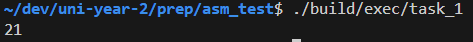
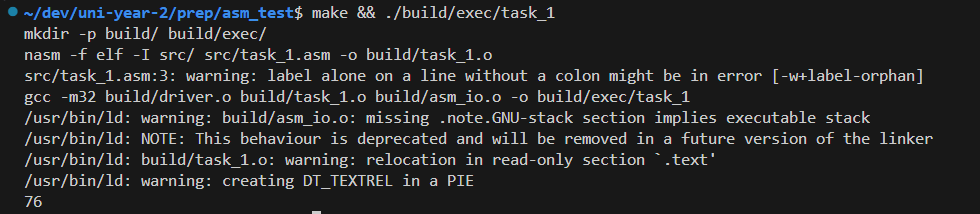
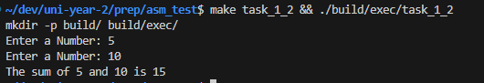
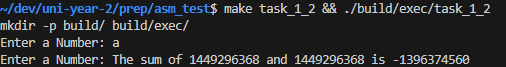
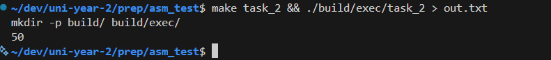
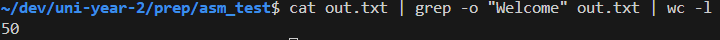
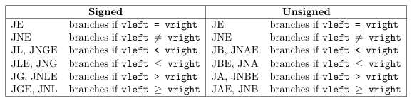

# Worksheet 1

# Task 1
## Overview 
Write a `.asm` file which adds 2 integers stored in global memory, and then outputs the result using `call print_int`

## Key Segments
``` assembly
segment.data
    integer1    dd  15  ; First Int
    integer2    dd  6   ; Second Int
```
In this section of code 2 varaibles are initalised as 2 double words = 4 bytes = standard int  in c
When run the output is <br>
<br>
When these numbers have been changed 
```
segment.data
    integer1    dd  10  ; First Int
    integer2    dd  66  ; Second Int
```


This works by simply loading int1 into eax then adding int2 then printing it 


# Task 1_2
## Overview
Add to task_1 to accept input from the user and give an output message in the form of the sum of x and y is z where z is the result of x + y
## Findings
I have discovered that the integers are 32 bit signed ints due to adding the 32bit int limit and recieving a negative
``` bash
~/dev/uni-year-2/prep/asm_test$ make task_1_2 && ./build/exec/task_1_2
mkdir -p build/ build/exec/
Enter a Number: 2147483647        
Enter a Number: 2147483647
The sum of 2147483647 and 2147483647 is -2
``` 

Ordinary addition works fine:<br>
<br>

letters provide an overflow of some sort: <br>
<br>

## Key segments
### Text printing 
``` assembly
; Print enter msg
mov eax, msg1       ; Move the Pointer to msg1 into eax
call print_string   ; Call print string on the pointer
```
Here is the standard to printing a string by loading the pointer to the string into the eax then calling print to print it to the string

### Number reading
``` assembly
; Read int into integer 1
call read_int       ; Read the first int into integer into eax
mov [integer1], eax ; save value held in eax to intgeter 1
```
Call read_int takes attempts to convert what was recieved into an int and saves it into eax
from here the integer is saved from eax -> value of integer1


# Task 2
## Overview
This tasks requires a `.asm` which Asks for the users name. Then requests the amount of times a welcome messages should be displayed. The range for the ouput should be between 50 and 100 and provide error messages when outside of this range or when input 1 > input 2.

## Testing 
For Testing Task 2 to check if all the loops where working correctly I used:
``` bash
make task_2 && ./build/exec/task_2 > out.txt 
```
This command builds task 2, runs it and pipes all outputs to out.txt overwriting all previous contents. Then i enter a valid range and after the program finishes. I run
``` bash
cat out.txt | grep -o "Welcome" out.txt | wc -l
```
This command takes the contents of out.txt which holds the output of task_2 with the range input. Pipes the file into grep to search for the \"Welcome\" string. After this the output of grep is piped into wc to count the number of lines of the welcome message
e.g:<br>
<br>


## Findings

## Key segments
### Loops 
Most of the loops in this program are done using cmp and then using jmp to go to the corresponding section. This is done using this table:<br>
<br>
> [!IMPORTANT]
> This table is from PC Assembly Language, Paul A. Carter, November 16, 2019

### String Reading


### Exit final loop
``` assembly
mov eax,[repeats]   ; repeat -> eax
sub eax,1           ; decrement 
mov [repeats],eax   ; repeat = repeat -1
jz Close_Program    ; if repeat = 0 jmp -> close
jnz Print_for_X     ; else: restart Loop
```
This loop exits by making use of when repeat - 1 = 0 the zero flag is set to 1 so jz will only jump if the zero flag is true so it exits. 

# Task 2_2
## Overview
Write a `.asm` file that stores an array from 1 -> 100 and that also takes in a lower bound and then an upper bound then sums all the integers between the two.
## Setup
A handy command to give the values of 1 -> 100 is to run 
``` bash
echo {1..100} | tr ' ' ',' > nums.txt 
```
Which creates 100 sequential numbers and replaces all the spaces with commas then outputs to nums.txt

## Key segments
### Error Handling
Error handling is done by holding a text string in the .data section
``` assembly
range_lower_enter   db  "Enter lower bound: ",0         ; 
range_lower_err     db  "Lower bound >= 1 ",0           ;
range_upper_enter   db  "Enter upper bound: ",0         ;
range_upper_err     db  "Upper bound <= 100 ",0         ;
range_lt_lower      db  "Upper bound > lower bound",0   ;
```
This allows for error code to simply load the corresponding error string print it and return to the most valid point of code e.g: 
``` assembly
err_upper:
    mov eax,range_upper_err
    call print_string
    call print_nl
    jmp enter_upper 
```

### Count Loop
#### Sum
``` assembly
mov ebx,[range_lower_int]   ; ebx = range_lower_int
add ebx,[loop_count]        ; ebx = loop_count + range_lower_int
mov eax,[arr+ebx*4]         ; Load the current index (arr ptr + index * index_size) into eax 
add eax,[count]             ; Add current count to number
mov [count],eax             ; Save count back to mem
```
To find the sum I have to make use of the other registers in this case i have used the ebx reg since it general purpose. This is because to find the current index in the array we need $$CI = Arr\_ptr + (range\_lower\_int + loop\_count)*int\_size$$ so that may look like 
``` assembly
mov eax, [arr + (range\_lower\_int + loop\_count) * 4] 
```
But this does not work since that array cannot be indexed like this at runtime so instead we have to load a register instead. But because we want to load the result into the eax we cannot use eax so we use ebx. So our current index now becomes $$EBX = range\_lower\_int + loop\_count$$ $$CI = Arr\_ptr + EBX*int\_size$$
which then leaves us with the assebmly 
``` assembly
mov ebx,[range_lower_int]   ; ebx = range_lower_int
add ebx,[loop_count]        ; ebx = loop_count + range_lower_int
mov eax,[arr+ebx*4]         ; Load the current index (arr ptr + index * index_size) into eax 
```


#### Loop increment
``` assembly
mov eax,[loop_count]
add eax,1
mov [loop_count],eax
```

#### Loop Break check
```
add eax,[range_lower_int]
cmp eax,[range_upper_int]
je print_count
jmp count_loop
```


# Task 3 (makefile)

## Folder structure
I designed my makefile to provide this file structure
```
├── build
│   ├── exec
│   │   └── EXECUTABLES
│   └── All Object files
├── src
│   ├── asm_io.asm
│   ├── asm_io.inc
│   ├── driver.c
│   ├── task_1.asm
│   ├── task_1_2.asm
│   ├── task_2.asm
│   └── task_2_2.asm
├── README.md
├── makefile
└── template.asm
```
## Build variables
``` makefile 
SRC = src/
BUILD_DIR = build/
EXE_DIR = $(BUILD_DIR)exec/
NASM_FLAGS = -f elf -I $(SRC)
```
In a makefile variables can be defined as 
``` makefile
Name = value
```
This then allows for the variables to be used like a template and placed in other sections of the code.
To use the variables the syntax is 
``` makefile
$(Variable)
```
For example the 'EXE_DIR' takes the current build directory and then adds the exec directory at the end

## Dir building
In make to build a file in a directory and watch the file the directory must first exist. 
To make sure that all the necessary directorys exist before building the code this rule is used:
``` makefile
dirs: 
	mkdir -p $(BUILD_DIR) $(EXE_DIR)
```
This rule simply attempts to make the directorys and sub directorys if they do not currently exist. 
If the directorys do exist it simply does nothing.

The dirs are built first using
```makefile
$(BUILD_DIR)task_2.o:	$(SRC)task_2.asm | dirs
```
Where | dirs is used to say that dirs has to be done before the building of the task can even start

## Make All 
To build all the tasks run
``` bash
make all
```
or 
``` bash
make 
```
This simply tries to build all the tasks using the ailiases as shown
``` makefile
all: task_1  task_1_2 task_2 task_2_2
```
## Task Building
``` makefile
# Task_2
task_2: $(EXE_DIR)task_2 
$(EXE_DIR)task_2: $(BUILD_DIR)task_2.o $(BUILD_DIR)driver.o $(BUILD_DIR)asm_io.o
	gcc -m32 $(BUILD_DIR)driver.o $(BUILD_DIR)task_2.o $(BUILD_DIR)asm_io.o -o $(EXE_DIR)task_2

$(BUILD_DIR)task_2.o:	$(SRC)task_2.asm | dirs
	nasm $(NASM_FLAGS) $(SRC)task_2.asm -o $(BUILD_DIR)task_2.o
```
To break down the code above: 
``` makefile
task_2: $(EXE_DIR)task_2
```
This is an ailias for task_2 meaning that to build task_2 it can be done through
``` bash
make /build/exec/task_2 
```
or 
```bash
make task_2
```
The reason for the ailiased build is due to make needing the file prefix to watch for file changes for incremental build.
This would mean if I wanted to change the build directory the make command would change with it but by ailiasing task_2 to 
\$(EXE_DIR)task_2, Regardless of what the exe_dir is i can just build with make task_2

## Make clean
To Remove the build directory and everything inside to have a clean build
``` bash
make clean
```
This simply recusively deletes all the folders from build and below
``` makefile
clean:
	rm -rf $(BUILD_DIR)
```
